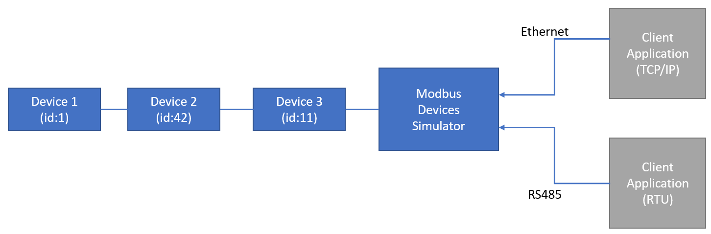

# Modbus Devices Simulator


This utility is able to simulate several Modbus devices on a common network (TCP or RTU).



## References

This project has been possible thanks to:

- [NModbus 3.0.78](https://www.nuget.org/packages/NModbus)

- [modbusPlcSimulator](https://github.com/alongL/modbusPlcSimulator).

## How to use

Quick Launch: `ModbusDevicesSimulator my-config.json`

```
Usage:
  ModbusDevicesSimulator <config-file> [options]

Arguments:
  <config-file>  Config file to use.

Options:
  --mode <rtu|tcp>  network mode to use.
  --version         Show version information
  -?, -h, --help    Show help and usage information
```

### config file

The network is described through an input config file. See [config-2-device](./data/config-2-devices.json) for a sample.

### data file

data played by the simulator are stored in CSV files like [data-1](./data/data-1.csv).
